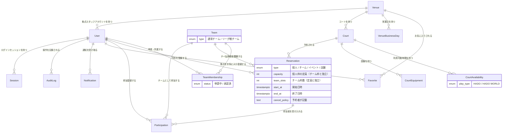

# データベース 要件定義書

作成日：2026-07-26
対象範囲：HADO コート予約システムのデータベース領域（要件定義工程）

本書は、既存の要件定義ドキュメント（`アプリケーション要求機能.md` / `個人情報保護方針.md` / `技術スタック提案.md` / `要件定義残タスク.md`）に**既に記載されている内容**を、データベース領域の観点で整理したものです。

- 詳細なカラム定義・型・インデックスの確定は**基本設計工程**で行います。本書は「何を持つ必要があるか」までを扱います。
- 出典が無く、本書で補った記述には **※補完** を付けています。補完は提案であり、確定事項ではありません。
- 未決事項は本書には書きません。`データベース_要件定義残タスク.md` を参照してください。

---

## 1. 技術前提（確定）

| 項目 | 内容 | 出典 |
|---|---|---|
| RDBMS | PostgreSQL 17（EDB の Windows インストーラ） | 技術スタック提案 2.3 |
| 稼働形態 | **Windows Server 単一VM 上のセルフホスト**（マネージドDBではない） | 技術スタック提案 1・2 |
| ORM / マイグレーション | **Prisma**（スキーマ・マイグレーション管理とも Prisma） | 技術スタック提案 1 |
| 必須拡張 | **`btree_gist`**（予約の時間帯重複防止の排他制約に使用） | 技術スタック提案 2.3 |
| タイムゾーン | **JST 固定**。日時カラムは `timestamptz`（Prisma で `@db.Timestamptz` を明示）。アプリ層で JST に変換 | 要求機能「ユーザーインターフェース」／技術スタック提案 3 |
| データ配置 | PostgreSQL のデータとアップロード画像は **OSディスクと別ボリューム** | 技術スタック提案 2.1 |
| キャッシュ | Redis 不採用。**セッションは PostgreSQL に保持する** | 技術スタック提案 1・5 |
| DB接続の切替 | 接続情報は `DATABASE_URL` 環境変数のみで切り替わること（将来のマネージドDB移行に備える） | 技術スタック提案 5 |
| コンテナ | Docker 不採用 | 技術スタック提案 1 |

### 1.1 セルフホストであることに起因する責任範囲

バックアップ・リストア・コネクション上限・チューニングは**自前責任**である。マネージドDBを前提とした設計（自動フェイルオーバ、自動バックアップ、リードレプリカ等）は行わない。

- 単一VM構成のため、アプリと DB がメモリを共有する。`shared_buffers` 等の配分方針が必要（`要件定義残タスク.md` B-3）。
- コネクションプールは Prisma の `connection_limit` と PostgreSQL の `max_connections` を突き合わせる（同 B-3）。

### 1.2 想定規模（DB設計の前提値）

| 指標 | 初期 | 1年後 | 3年後 |
|---|---|---|---|
| ユーザー数 | 500 | 1,000 | 2,000 |
| 拠点数 | 20 | 30 | 50 |

同時接続ユーザー100人、予約登録スループット 5件/分、画面表示 3秒以内、予約登録 5秒以内（要求機能「パフォーマンス要件」）。

---

## 2. 概念モデル

### 2.1 主要エンティティ

| エンティティ | 役割 | 主な出典 |
|---|---|---|
| `User` | 利用者。権限は メンバー / チームリーダー / 拠点スタッフ / システム管理者 | 要求機能「利用者」 |
| `Team` | チーム。**通常チーム**と**リーグ戦チーム**の2種を区別する | 要求機能「チーム」 |
| `TeamMembership` | ユーザーとチームの所属関係。**申請中 / 承認済**の状態を持つ | 要求機能「チームリーダー」 |
| `Venue` | 拠点。新規登録・削除はシステム管理者が行う | 要求機能「拠点」 |
| `VenueBusinessDay` | 拠点の営業日・営業時間 | 要求機能「拠点」 |
| `Court` | コート。1拠点に複数存在しうる | 要求機能「概要」「コート」 |
| `CourtAvailability` | コートの利用可能時間と利用可能種別（HADO / HADO WORLD） | 要求機能「コート」 |
| `CourtEquipment` | コートの利用可能設備 | 要求機能「コート」 |
| `Reservation` | 予約。種別は 個人 / チーム / イベント / 店舗。定員・チーム枠・キャンセルポリシーを持つ | 要求機能「予約」 |
| `Participation` | 予約への参加登録（個人参加・チーム参加） | 要求機能「メンバー」「チームリーダー」 |
| `Favorite` | お気に入り拠点 | 要求機能「予約検索・フィルター機能」 |
| `Notification` | アプリ内通知 | 要求機能「キャンセルポリシー管理・通知機能」 |
| `AuditLog` | 監査ログ（180日保持） | 要求機能「データベース要件」 |
| `Session` ※補完 | サーバー側セッション。二重ログイン後勝ちの要件を満たすため DB 保持が必須 | 技術スタック提案 6・要求機能「ユーザー認証・登録機能」 |

### 2.2 概要ER図（概念レベル）

> 本ER図は**エンティティと関連の把握**を目的とした概要レベルです。カラム・型・カーディナリティの厳密化は基本設計で行います。
> `Session` は ※補完（要件から必然的に導かれるが、既存ドキュメントに明示のないエンティティ）。

### 2.3 関連についての確定事項と注記

- **1拠点に複数コート**が存在しうる（要求機能「概要」）。
- **拠点スタッフは各拠点1アカウント**とし、拠点のスタッフ間で共有する。自拠点のみ管理・閲覧可能（要求機能「拠点スタッフ」）。したがって `User` は所属拠点への参照を持つ。
- 通常チームは**リーダー1名 + メンバー9名まで**（要求機能「チーム」）。
- リーグ戦チームは**システム管理者による承認**が必要（要求機能「用語定義」）。通常チームの所属申請は**チームリーダーの承認**（要求機能「チームリーダー」）。
- イベント予約は**複数コートを同時予約することも可能**（要求機能「用語定義」）。上図では `Court ||--o{ Reservation` としているが、複数コート予約のデータ表現は**未決**であり、残タスクで扱う。

---

## 3. データ要件（DBで担保すべき整合性）

要件から導かれる、**DB制約として表現すべき**事項。アプリ層のチェックのみに頼らない。

### 3.1 定員とチーム枠は独立して保持する

- 各予約は**定員を必須で設定**する。定員に達した場合は予約不可（要求機能「予約」）。
- チーム枠は「チームとして参加するメンバー数の上限」であり、**定員とは別に設定する**。チーム枠2枠・定員9名なら、チーム枠以外で3名の個人参加者を受け入れる（要求機能「用語定義」「予約」補足）。
- したがって `capacity`（個人枠の定員）と `team_slots`（チーム枠数）は**別カラム**で保持する。1カラムに混ぜない。
- 定員・チーム枠は**負数を許容しない**（CHECK制約）※補完。

### 3.2 同一コート・同一時間帯の予約重複を禁止する

- 同一コートの時間帯重複は **PostgreSQL の排他制約**（`EXCLUDE USING gist` + `tstzrange` + `btree_gist` 拡張）で表現する。
- Prisma スキーマでは表現できないため、マイグレーションSQLに手書きで追加する（第5章）。
- 開始 < 終了 であること（CHECK制約）※補完。
- コートが利用不可な場合、拠点スタッフが**予約を登録することで利用不可状態を表現する**（要求機能「コート」）。すなわち利用不可は予約と同じ排他制約の対象となる。

### 3.3 参加の重複を禁止する

- 同一予約に同一ユーザーが二重に参加登録されないこと。`(reservation_id, user_id)` に一意制約を設ける。

### 3.4 チーム申請の一意性

- ユーザーは**所属チームの申請を1つのみ**、**リーグ戦所属チームの申請を1つのみ**行える（要求機能「メンバー」）。
- Prisma では表現できないため、**部分一意インデックス**（`WHERE` 付き UNIQUE）をマイグレーションSQLに手書きする。

### 3.5 参照整合性

- 外部キーを張り、孤児レコードが発生しないようにする。
- リレーションには `onDelete` の挙動（`Cascade` / `Restrict` / `SetNull`）を**必ず明示する**。Prisma の既定挙動に任せない。
- 外部キーカラムには `@@index` を明示する（Prisma は PostgreSQL で FK に自動でインデックスを作らない）。

### 3.6 主要クエリとインデックス方針

主クエリは**スイムレーン表示（拠点 + 日付 + コート）**（要求機能「概要」、画面ワイヤー1）。最低限、次を用意する。

- `reservations(court_id, start_at)`
- `courts(venue_id)`
- `favorites(user_id)`

### 3.7 同時実行時の解決順序

同時にアクセスが発生した場合、リクエスト送信時刻を**マイクロ秒まで比較して先勝ち**、全く同時刻の場合は**利用者の登録番号が大きい利用者を優先**する（要求機能「エラーハンドリング」）。したがってユーザーは比較可能な「登録番号」を保持する必要がある。

---

## 4. データ保持・削除ポリシー

### 4.1 要件（`アプリケーション要求機能.md`「データ保持・削除ポリシー」「データベース要件」）

| 対象 | ポリシー |
|---|---|
| 予約データ | 日付が過ぎた時点で**物理削除** |
| 退会ユーザー情報 | 退会時点で**物理削除** |
| 拠点情報 | 削除時点で**物理削除** |
| 紛争解決に必要な情報（予約登録者・参加者等） | **12ヶ月間保持** |
| 監査ログ | **180日間保持** |
| バックアップ | 1日1回 03:00 取得、**30日保持** |
| ログファイル | 月〜日で記録し5世代管理 |

### 4.2 物理削除と12ヶ月保持の両立方針

物理削除と12ヶ月保持は**そのままでは矛盾する**。方針は以下のとおり。

- 削除対象から退避する**保持用テーブル**（最小限の項目のみ）を設ける。
- カスケード削除によって12ヶ月保持すべき情報まで消える設計にしない。
- 退会・拠点削除・予約日経過の**各削除経路について、何が消えて何が残るかを説明できる**状態にする。

> **保持用テーブルの要否・保持項目・保持起算日は未確定**です。`データベース_要件定義残タスク.md` の最優先項目として扱います。

### 4.3 削除処理の実行方式

- 予約日経過・退会・拠点削除の削除処理は、**Windows Server のタスクスケジューラから起動するバッチ**として設計する（cron は存在しない）。
- 紛争解決用データ（12ヶ月保持）の退避処理も同バッチの責務（`要件定義残タスク.md` B-6）。

### 4.4 バックアップ

- `pg_dump` をタスクスケジューラで毎日 03:00 実行、30日保持。
- 取得後は**別ロケーション（オブジェクトストレージ等）へ退避する**。単一VM構成のため、サーバー内のみの保持ではサーバー障害時に一緒に失われる。
- バックアップの成否を Zabbix で監視する。
- RPO 最大24時間・RTO 数時間が現構成の実測見込み（目標値は未決）。

---

## 5. 個人情報の取り扱い

### 5.1 要件

- **個人情報に関するデータは暗号化して保管する**（要求機能「データベース要件」）。
- **パスワードはハッシング・ソルト処理により保管する**（要求機能「セキュリティ」、個人情報保護方針 4.2）。暗号化ではなくハッシュであること。可逆暗号・平文保管は重大違反。
- データベースは厳格なアクセス制御下に置く（個人情報保護方針 4.2）。
- 個人情報へのアクセスは職務上必要な者に限定し、アクセスログを監査目的で保持する（同 4.3）。
- 日本の個人情報保護法（APPI）に準拠する（同 10）。

### 5.2 個人情報として収集される項目（個人情報保護方針 2）

| 区分 | 項目 |
|---|---|
| 基本情報 | プレイヤーネーム / メールアドレス / パスワード |
| プロフィール情報 | プロフィール画像 / 自己紹介文 / プレースタイル |
| 予約関連情報 | 予約日時 / 拠点・コート選択 / チーム情報 / キャンセルポリシー記載内容 |
| 自動収集情報 | IPアドレス / ユーザーエージェント / アクセス日時・ログ / クッキー情報 |
| 拠点・チーム提供情報 | チーム名・画像・紹介 / 拠点名・画像 / コート名・設備情報 |

> どのカラムを暗号化対象とするか、暗号化方式（アプリ層暗号化 / pgcrypto / ディスク暗号化）の選択は**未決**。残タスクで扱う。

### 5.3 ログへの出力禁止

- ログに個人情報・パスワード・トークンを出力しない（Prisma のクエリログ設定を含む）（技術スタック提案 4.4）。
- 生成された Prisma の型をそのままクライアントへ渡さない（個人情報カラムが混入する）。

### 5.4 監査ログ

- 拠点スタッフは1拠点1アカウント共有のため、**誰が操作したかはログイン時刻から推測する運用**（要求機能「拠点スタッフ」）。
- `AuditLog` には**セッションID・ログイン時刻・操作種別・対象・変更前後**を残す。保持180日。
- 監査ログ自体に不要な個人情報を溜め込まないこと。

> 記録対象の操作範囲・変更前後の保持形式は**未決**。残タスクで扱う。

---

## 6. Prisma 運用ルール（確定）

`技術スタック提案.md` 3章の内容をDB領域の観点で再掲する。

1. **`prisma db push` は使用しない。** 排他制約（`EXCLUDE USING gist`）と部分一意インデックスは Prisma スキーマで表現できず、マイグレーションSQLに手書きで追加するため、`db push` はこれを失う。
2. スキーマ変更は **`prisma migrate dev --create-only`** でSQLを生成し、必要な手書きSQLを追記してから適用する。
   - 排他制約の追加時は `CREATE EXTENSION IF NOT EXISTS btree_gist;` と `ALTER TABLE ... ADD CONSTRAINT ... EXCLUDE USING gist (...)` を手書きする。
3. **本番へは `prisma migrate deploy`。** `migrate dev` / `migrate reset` は本番で実行しない（DBリセット・全消去の危険）。
4. 日時カラムは **`@db.Timestamptz` を明示する**（無指定だとタイムゾーンなしになる）。
5. 外部キーカラムには **`@@index` を明示する**（Prisma は自動作成しない）。
6. Prisma が管理しないDBオブジェクト（拡張・トリガ・関数・一部CHECK制約）を使う場合、`schema.prisma` 側に対応記述が無いことを**コメントで明示**し、`prisma migrate diff` でドリフトを検知できる状態を保つ。
7. テストDBは `migrate deploy` で構築する（`db push` では手書きSQLの制約が入らない）。ローカルDBは `hado_schedules_dev`、テスト用は `hado_schedules_test`。
8. 破壊的なマイグレーション（DROP / 型変更 / NOT NULL 追加）は既存データへの影響を説明し、承認を挟む。Prisma に down マイグレーションは無いため、戻す手段を別途用意する。

### 6.1 スキーマの配置

- スキーマ・マイグレーション実体：`Source/Next.js/hado-schedules/prisma/`（**2026-07-26 時点で未作成**）
- 設計ドキュメント：`Docs/hado-schedule/`

---

## 7. 本書が扱わない範囲

- 画面設計・API設計・インフラ構築手順（他領域の担当）
- 実装しない機能のデータ（チェックイン / 決済 / レビュー / レポート / 利用分析 / キャンセル待ち）
- カラム単位の型・既定値・制約の確定（基本設計工程）

---

## 参照元

- `Docs/hado-schedule/01_要件定義/アプリケーション要求機能.md`
- `Docs/hado-schedule/01_要件定義/個人情報保護方針.md`
- `Docs/hado-schedule/01_要件定義/要件定義残タスク.md`
- `Docs/hado-schedule/01_要件定義/画面ワイヤー下書き.md`
- `Docs/hado-schedule/技術スタック提案.md`
