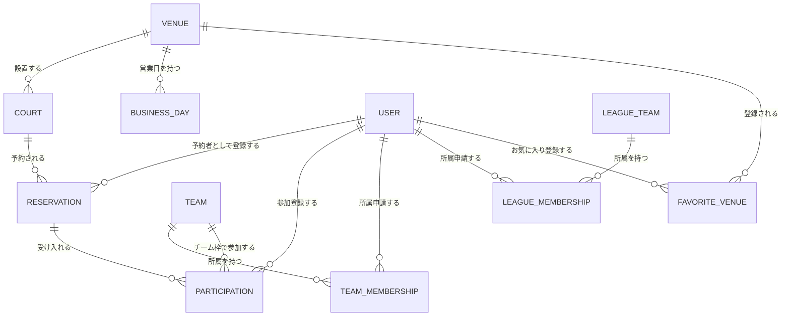
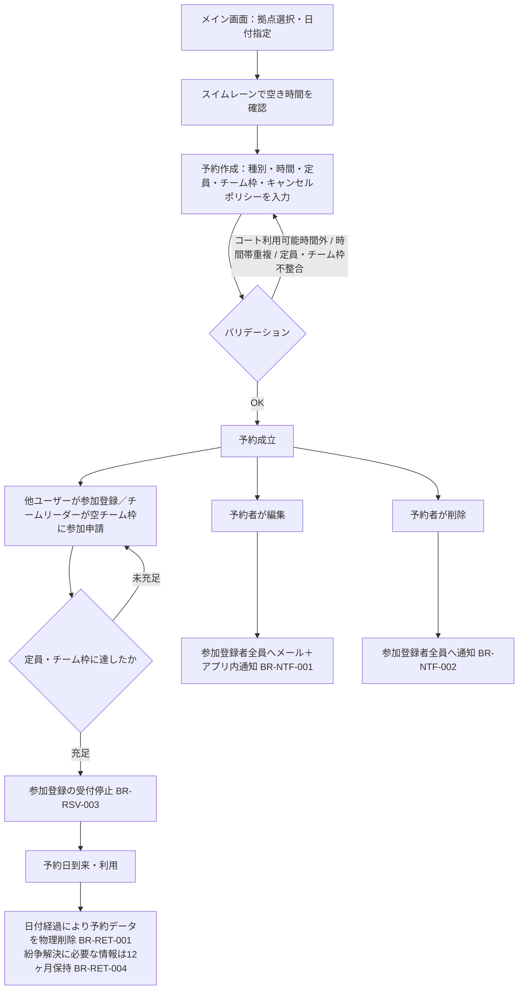
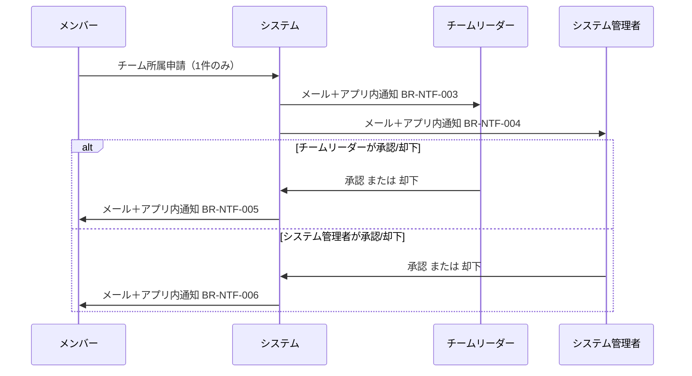
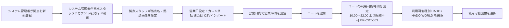
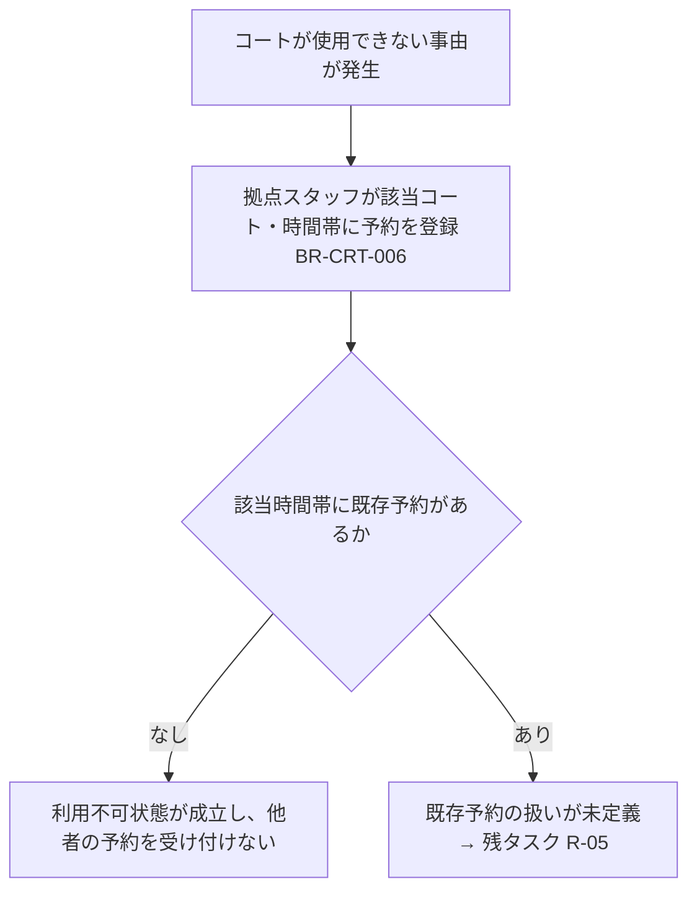
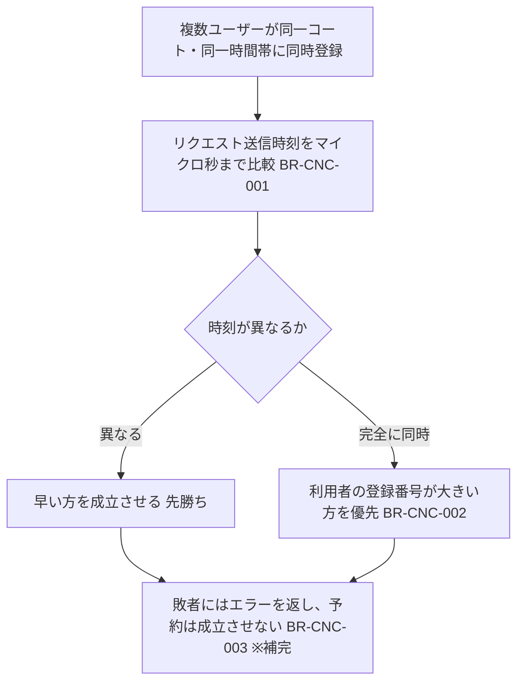

# 業務要件 要件定義書

作成日：2026-07-26
対象領域：業務要件（ドメインモデル／業務ルール／権限／業務フロー／用語）
一次情報：`アプリケーション要求機能.md`（最優先の正）

## 0. 本書の位置づけと読み方

- 本書は既存ドキュメントで**すでに決定している業務要件**を、検証可能な粒度に再構成したものである。新規要件の創作は行っていない。
- 既存記述から論理的に導いた補完には **※補完** を付す。補完は決定事項ではなく、否定されなければ採用する前提として扱う。
- 未決事項・矛盾は本書には書かず、`業務要件_要件定義残タスク.md` に集約する。本書中で未決に触れる場合は **→ 残タスク {ID}** と参照のみを置く。
- 対象外：DB設計、API設計、インフラ、画面実装仕様、非機能要件の数値（`アプリケーション要求機能.md` システム要件章および `技術スタック提案.md` に準拠）。

---

## 1. 用語定義

| 用語 | 定義 | 出典 |
|---|---|---|
| 拠点（Venue） | コートが設置されている施設の単位。複数のコートを持ちうる。新規登録はシステム管理者が行う | 要求機能「概要」「拠点」 |
| コート（Court） | 予約対象となる物理的な最小単位。1つの拠点に属する | 要求機能「概要」「コート」 |
| 営業日 | 拠点が営業する日。拠点管理画面のカレンダーで月／週／曜日を一括設定でき、CSVインポートも可能 | 要求機能「拠点」 |
| 営業時間 | 営業日内に拠点が営業する時間帯 | 要求機能「拠点」 |
| 利用可能時間 | 拠点の営業時間内で、コートごとに設定する予約可能な時間帯 | 要求機能「コート」 |
| 利用可能種別 | コートで実施可能な競技種別。HADO / HADO WORLD から選択 | 要求機能「コート」 |
| 利用可能設備 | コートに配置されている設備。メインモニター／サブモニター／三脚／SDカード録画／その他（自由入力1つ） | 要求機能「コート」 |
| 利用不可設定 | コートが使用できない状態を、拠点スタッフが予約を登録することで表現する運用 | 要求機能「コート」 |
| 予約（Reservation） | コートの特定時間帯を占有する登録。個人／チーム／イベント／店舗の4種別を持つ | 要求機能「概要」「予約」 |
| 予約者 | 予約を登録した利用者。予約の編集・削除の主体 | 要求機能「予約」 |
| 参加登録者（参加者） | フリーで募集されている予約に対して参加を登録した利用者 | 要求機能「メンバー」 |
| 定員 | 予約に受け入れる人数の上限。全予約種別で必須設定。チーム枠を併用する場合、定員は**チーム枠を除いた人数**を指す | 要求機能「予約」 |
| チーム枠 | 予約時に設定する「チームとして参加するチームの上限枠数」。例：チーム枠2枠・定員9名 → チーム2つに加えて個人参加者3名を受け入れる | 要求機能「用語定義／チーム枠」「予約 補足」 |
| チーム | HADO に公認チーム登録されているチーム。リーダー1名＋メンバー9名まで（最大10名） | 要求機能「チーム」 |
| リーグ戦チーム | 複数チームに所属するユーザーが公式リーグ大会等に出場する際に使用する主要チーム。システム管理者の承認が必要。拠点スタッフが登録するイベント予約に登録できる | 要求機能「用語定義」「リーグ戦チーム」 |
| 個人予約 | 個人が登録する予約 ※補完（種別名のみ既出、登録主体はメンバー操作「コート予約登録」から補完） | 要求機能「予約」「メンバー」 |
| チーム予約 | チームリーダーがチームとして登録する予約 | 要求機能「チームリーダー」 |
| イベント予約 | 拠点が主催するイベント（試合、トーナメント等）としての予約。拠点スタッフが登録。複数コートの同時予約が可能 | 要求機能「用語定義」 |
| 店舗予約 | 拠点スタッフが営業・運用目的で行う予約。メンテナンス予約・施設点検等 | 要求機能「用語定義」 |
| キャンセルポリシー | 予約登録者が各予約に自由記述で記載できる方針テキスト | 要求機能「キャンセルポリシー管理・通知機能」 |
| お気に入り拠点 | 利用者がメイン画面で拠点に設定するフラグ。メイン画面の初期表示対象となる | 要求機能「メンバー」「予約検索・フィルター機能」 |
| スイムレーン | メイン画面の予約状況表示。横軸に時間（10:00〜22:00・30分刻み）、縦軸にコートを取る | 要求機能「概要」／画面ワイヤー下書き 1 |
| メンバー／チームリーダー／拠点スタッフ／システム管理者 | 利用者ロール4種。第4章参照 | 要求機能「利用者」 |

### 1.1 用語使用上の注意

- **「チーム」と「リーグ戦チーム」は別エンティティ**として扱う。申請枠も承認者も別である（第4章・第5章）。本書および後続設計で混同しないこと。
- **「イベント予約」と「店舗予約」は別種別**である。どちらも拠点スタッフが登録するが、目的（イベント開催 vs 営業・運用）が異なる。
- 「予約者」と「参加登録者」を区別する。予約の編集・削除権は予約者のみが持つ。

---

## 2. ドメインモデル

### 2.1 エンティティ関連（概念レベル）

※本図は業務上の関係を示すものであり、テーブル設計（ER図）ではない。DB設計は別領域の担当とする。

### 2.2 主要エンティティの構成要素

#### 拠点（Venue）

| 属性 | 内容 | 決定状況 |
|---|---|---|
| 拠点名 | 拠点スタッフが編集可能 | 確定 |
| 拠点画像 | 拠点スタッフが登録可能 | 確定 |
| 営業日 | カレンダーで月／週／曜日を一括設定。CSVインポート可 | 確定 |
| 営業時間 | 営業日ごとに設定 | 確定 |
| 登録順 | メイン画面でお気に入りが無い場合の表示順に使用 | 確定 |

- 拠点の新規登録・追加・削除はシステム管理者のみが行う。

#### コート（Court）

| 属性 | 内容 | 決定状況 |
|---|---|---|
| コート名 | 拠点スタッフが編集可能 | 確定 |
| 利用可能時間 | 拠点の営業時間内で設定。**10:00〜22:00 より短縮不可** | 確定 |
| 利用可能種別 | HADO / HADO WORLD | 確定 |
| 利用可能設備 | メインモニター／サブモニター／三脚／SDカード録画／その他（自由入力1つ） | 確定 |
| 利用可否状態 | 拠点スタッフが予約を登録することで「利用不可」を表現する | 確定（副作用は未確定 → 残タスク R-05） |

#### 予約（Reservation）

| 属性 | 内容 | 必須 |
|---|---|---|
| 予約種別 | 個人／チーム／イベント／店舗 | 必須 |
| 拠点・コート | イベント予約は複数コート指定可 | 必須 |
| 日付・開始時刻・終了時刻 | JST 固定 | 必須 |
| 定員 | 全種別で必須。チーム枠併用時はチーム枠を除いた人数 | **必須** |
| チーム枠 | チームとして参加できるチーム数の上限。0 も可 ※補完 | 任意 |
| キャンセルポリシー | 予約登録者が自由記述 | 任意 |
| 予約者 | 登録した利用者。編集・削除の主体 | 必須 |

#### 利用者（User）

| 属性 | 内容 |
|---|---|
| メールアドレス | ユーザー識別子。同一人物が複数アカウントを登録することは可能 |
| パスワード | 最小8文字、大文字・小文字・数字を含む |
| 名前（プレイヤーネーム） | 本人が設定 |
| プロフィール画像 | 本人が登録 |
| 自己紹介 | 本人が登録 |
| メインプレースタイル | アタッカー／ディフェンダー／サポーター から選択 |
| ロール | メンバー／チームリーダー／拠点スタッフ／システム管理者 |
| 所属チーム | 最大1（申請は1つのみ） |
| 所属リーグ戦チーム | 最大1（申請は1つのみ） |
| お気に入り拠点 | ON/OFF フラグで管理（上限は矛盾あり → 残タスク R-14） |

#### チーム／リーグ戦チーム

| 項目 | チーム | リーグ戦チーム |
|---|---|---|
| 定義 | HADO 公認登録チーム | リーグ戦出場用の主要チーム |
| 構成 | リーダー1名＋メンバー9名まで（最大10名） | 通常のチームと異なる編成をとりうる（人数上限は未定 → 残タスク R-16） |
| ユーザーの申請上限 | 1つのみ | 1つのみ |
| 承認 | チームリーダーが承認（システム管理者にも通知される） | システム管理者の承認が必須（チームリーダーも承認操作を持つ） |
| 編集可能項目 | チーム名／チーム画像／チーム紹介（チームリーダー） | 同左 |
| 予約との関係 | チーム予約を登録できる。他チームの予約の空チーム枠に参加申請できる | 拠点スタッフが登録するイベント予約に登録できる |

---

## 3. 業務ルール

検証可能な単位でIDを付す。テストケースの参照元として使用する。

### 3.1 拠点・コート（BR-VNU / BR-CRT）

| ID | ルール | 出典 |
|---|---|---|
| BR-VNU-001 | 拠点の新規登録・追加・削除はシステム管理者のみが実行できる | 要求機能「拠点」「システム管理者」 |
| BR-VNU-002 | 営業日は拠点管理画面のカレンダーから、月単位・週単位・曜日単位で一括して営業／休業を設定できる | 要求機能「拠点」 |
| BR-VNU-003 | 営業日はCSVインポートによっても登録できる | 要求機能「拠点」 |
| BR-VNU-004 | 営業時間は営業日内でのみ設定できる | 要求機能「拠点」 |
| BR-CRT-001 | コートは必ず1つの拠点に属する | 要求機能「概要」 |
| BR-CRT-002 | コートの利用可能時間は拠点の営業時間内で設定する | 要求機能「コート」 |
| BR-CRT-003 | コートの利用可能時間は **10:00〜22:00 を下限**とし、これより短い範囲に短縮することはできない。拡張（早開き・遅閉じ）は可能 | 要求機能「コート」 |
| BR-CRT-004 | 利用可能種別は HADO / HADO WORLD から選択する | 要求機能「コート」 |
| BR-CRT-005 | 利用可能設備はメインモニター／サブモニター／三脚／SDカード録画／その他から選択する。「その他」は自由入力で**1つまで** | 要求機能「コート」 |
| BR-CRT-006 | コートを利用不可にする場合、拠点スタッフが該当時間帯に予約を登録することで表現する | 要求機能「コート」 |
| BR-CRT-007 | コートの追加・削除・コート名編集・設備編集は拠点スタッフが行う（自拠点のみ） | 要求機能「拠点スタッフ」 |

### 3.2 予約の登録（BR-RSV）

| ID | ルール | 出典 |
|---|---|---|
| BR-RSV-001 | 予約種別は 個人予約／チーム予約／イベント予約／店舗予約 の4種のいずれかである | 要求機能「概要」 |
| BR-RSV-002 | すべての予約種別で定員を必須で設定する | 要求機能「予約」 |
| BR-RSV-003 | 参加人数が定員に達した予約は、それ以上の参加登録を受け付けない | 要求機能「予約」 |
| BR-RSV-004 | 各予約にチーム枠（チームとして参加できるチーム数の上限）を設定できる | 要求機能「予約」 |
| BR-RSV-005 | チーム枠と定員は同時に設定でき、その場合の定員は**チーム枠として参加する人数を除いた人数**である（例：チーム枠2枠・定員9名 → チーム2つ＋個人3名） | 要求機能「用語定義／チーム枠」「予約」 |
| BR-RSV-006 | 同一コート・同一時間帯に重複する予約は登録できない | 画面ワイヤー「重複チェック」／技術スタック提案 3章（排他制約） |
| BR-RSV-007 | 予約はコートの利用可能時間内でのみ登録できる ※補完（利用可能時間の定義から導出） | 要求機能「コート」 |
| BR-RSV-008 | 予約はスイムレーン表示の刻みと同じ **30分単位**で扱う ※補完（30分刻み表示・ズーム単位30分/1時間から導出。最小/最大予約時間は未決 → 残タスク R-08） | 要求機能「概要」／画面ワイヤー 1 |
| BR-RSV-009 | イベント予約は複数コートを同時に予約できる | 要求機能「用語定義／イベント予約」 |
| BR-RSV-010 | 予約に関する日時はすべて JST（日本標準時）で扱い、他タイムゾーンへの切替は行わない | 要求機能「ユーザーインターフェース」 |
| BR-RSV-011 | 予約登録者はキャンセルポリシーを自由記述で記載できる。システムはこれを表示するのみで、記載内容に基づく自動制御は行わない ※補完 | 要求機能「キャンセルポリシー管理・通知機能」 |

> BR-RSV-003 / 005 の充足判定（チーム参加時に定員・チーム枠をどう消費するか）は数式レベルで確定していない → **残タスク R-10**。
> 同一ユーザーの同一時間帯における重複予約の可否は未定義 → **残タスク R-17**。

### 3.3 予約の編集・削除（BR-EDT）

| ID | ルール | 出典 |
|---|---|---|
| BR-EDT-001 | 予約者は予約登録後、予約内容を編集できる | 要求機能「予約」 |
| BR-EDT-002 | 予約の編集・削除は**予約者のみ**が可能である | 要求機能「予約」 |
| BR-EDT-003 | システム管理者は例外として全予約の編集・削除が可能である | 要求機能「予約」 |
| BR-EDT-004 | 予約が編集された場合、参加登録しているすべての利用者に**メールおよびアプリ上**で通知する | 要求機能「キャンセルポリシー管理・通知機能」 |
| BR-EDT-005 | 予約者が予約を削除した場合、参加登録者全員に通知する | 要求機能「予約」 |
| BR-EDT-006 | 拠点スタッフは自拠点のコートの予約状況を登録・編集・削除できる | 要求機能「拠点スタッフ」 |

> BR-EDT-002 と BR-EDT-006 は文言上両立しない。適用範囲の切り分けが必要 → **残タスク R-01**。
> BR-EDT-005 の通知手段（メール／アプリ内）は明示されていない → **残タスク R-11**。

### 3.4 参加登録（BR-JOIN）

| ID | ルール | 出典 |
|---|---|---|
| BR-JOIN-001 | メンバーはフリーで募集されている予約に参加登録できる | 要求機能「メンバー」 |
| BR-JOIN-002 | チームリーダーは、他のチームが予約した予約の**空チーム枠**に対して参加申請できる | 要求機能「チームリーダー」 |
| BR-JOIN-003 | メンバーは自分が参加した予約の履歴を確認できる | 要求機能「メンバー」 |
| BR-JOIN-004 | リーグ戦チームは、拠点スタッフが登録するイベント予約に登録できる | 要求機能「リーグ戦チーム」 |

> 「フリーで募集されている」の判定条件、参加申請の承認者、参加取消の可否と通知は未定義 → **残タスク R-03 / R-04 / R-11**。

### 3.5 チーム（BR-TEAM）

| ID | ルール | 出典 |
|---|---|---|
| BR-TEAM-001 | チームはリーダー1名＋メンバー9名まで（合計最大10名）で構成する | 要求機能「チーム」 |
| BR-TEAM-002 | 利用者が申請できる所属チームは**1つのみ**である | 要求機能「メンバー」 |
| BR-TEAM-003 | 利用者が申請できる所属リーグ戦チームは**1つのみ**である | 要求機能「メンバー」 |
| BR-TEAM-004 | リーグ戦チームの登録にはシステム管理者による承認が必要である | 要求機能「用語定義／リーグ戦チーム」 |
| BR-TEAM-005 | チームリーダーはチーム所属申請およびリーグ戦所属チーム申請を承認できる | 要求機能「チームリーダー」 |
| BR-TEAM-006 | チームリーダーはチーム／リーグ戦チームのチーム名・チーム画像・チーム紹介を編集できる | 要求機能「チームリーダー」 |
| BR-TEAM-007 | メンバーからチーム／リーグ戦チーム登録申請があった場合、チームリーダーとシステム管理者の**両方**にメールおよびアプリ上で通知する | 要求機能「キャンセルポリシー管理・通知機能」 |
| BR-TEAM-008 | 申請が承認／却下された場合、申請したメンバーにメールおよびアプリ上で通知する（承認者がチームリーダーの場合・システム管理者の場合の双方） | 要求機能「キャンセルポリシー管理・通知機能」 |

> チームとリーグ戦チームで承認者が誰か（単独承認か二段階承認か）が確定していない → **残タスク R-02**。

### 3.6 利用者・アカウント（BR-USR）

| ID | ルール | 出典 |
|---|---|---|
| BR-USR-001 | 利用者はメールアドレスを用いてユーザー登録する | 要求機能「ユーザー認証・登録機能」 |
| BR-USR-002 | 同一人物による複数アカウント登録を可能とする | 要求機能「ユーザー認証・登録機能」 |
| BR-USR-003 | 各アカウントは二重ログイン不可。既にログイン中の場合は**後勝ち**とし、既存接続を強制切断する | 要求機能「ユーザー認証・登録機能」 |
| BR-USR-004 | 初回登録時およびパスワード再設定時は、ランダムな文字列をシステムがメールで通知する | 要求機能「ユーザー認証・登録機能」 |
| BR-USR-005 | 多段階認証は行わない | 要求機能「ユーザー認証・登録機能」 |
| BR-USR-006 | 拠点スタッフは各拠点1アカウントとし、拠点のスタッフ間で共有する | 要求機能「拠点スタッフ」 |
| BR-USR-007 | 拠点スタッフは自拠点のみ管理・閲覧可能である | 要求機能「拠点スタッフ」 |
| BR-USR-008 | 拠点スタッフの操作はすべてログに記録する（操作者個人はログイン時刻から推測する運用） | 要求機能「拠点スタッフ」 |

> BR-USR-003 と BR-USR-006 は共有アカウントの同時利用を不能にする → **残タスク R-06**。
> BR-USR-008 は「推測」であり監査要件として検証不能 → **残タスク R-07**。

### 3.7 検索・表示（BR-DSP）

| ID | ルール | 出典 |
|---|---|---|
| BR-DSP-001 | メイン画面はコートごとに30分刻みのスイムレーンを表示する。表示範囲は 10:00〜22:00 | 要求機能「概要」 |
| BR-DSP-002 | メイン画面の初期表示は、ログインユーザーのお気に入り拠点に紐づくコートとする | 要求機能「予約検索・フィルター機能」 |
| BR-DSP-003 | お気に入り拠点がない場合は、拠点の登録順に左から表示する | 要求機能「予約検索・フィルター機能」 |
| BR-DSP-004 | 拠点を選択することで表示にフィルターをかけられる | 要求機能「予約検索・フィルター機能」 |
| BR-DSP-005 | 日付を指定すると対象の拠点／コートを表示する | 要求機能「予約検索・フィルター機能」 |
| BR-DSP-006 | フィルター条件は拠点ごとに保存できる | 要求機能「予約検索・フィルター機能」 |
| BR-DSP-007 | お気に入りは拠点名に対するアイコンで ON/OFF フラグとして管理する | 要求機能「予約検索・フィルター機能」 |

> お気に入りの上限が「上限10件」と「上限は設けない」で矛盾 → **残タスク R-14**。

### 3.8 通知（BR-NTF）

要求機能に明記されている通知は以下がすべてである。**これ以外の通知は「記載されていない通知機能」に該当し、実装しない。**

| ID | 契機 | 通知先 | 手段 | 出典 |
|---|---|---|---|---|
| BR-NTF-001 | 予約情報が編集された | 参加登録しているすべての利用者 | メール＋アプリ内 | 要求機能 |
| BR-NTF-002 | 予約者が予約を削除した | 参加登録者全員 | 記載なし → 残タスク R-11 | 要求機能「予約」 |
| BR-NTF-003 | メンバーからチーム／リーグ戦チーム登録申請があった | チームリーダー | メール＋アプリ内 | 要求機能 |
| BR-NTF-004 | メンバーからチーム／リーグ戦チーム登録申請があった | システム管理者 | メール＋アプリ内 | 要求機能 |
| BR-NTF-005 | チームリーダーが申請を承認／却下した | 申請したメンバー | メール＋アプリ内 | 要求機能 |
| BR-NTF-006 | システム管理者が申請を承認／却下した | 申請したメンバー | メール＋アプリ内 | 要求機能 |
| BR-NTF-007 | システムメンテナンスを行う | すべてのユーザー | メール＋アプリ内 | 要求機能 |
| BR-NTF-008 | パスワードを忘れた場合のリセット | 本人 | メール | 要求機能「ユーザー認証・登録機能」 |
| BR-NTF-009 | 初回登録／パスワード再設定 | 本人 | メール（ランダム文字列） | 要求機能「ユーザー認証・登録機能」 |
| BR-NTF-010 | メール配信に失敗した | －（システムログに記録） | 3回まで自動リトライ | 要求機能 |

### 3.9 同時実行・競合（BR-CNC）

| ID | ルール | 出典 |
|---|---|---|
| BR-CNC-001 | 同時にアクセスが発生した場合、リクエスト送信時刻を**マイクロ秒**まで比較して先勝ちとする | 要求機能「エラーハンドリング」 |
| BR-CNC-002 | 完全に同時刻の場合、利用者の**登録番号が大きい**利用者を優先する | 要求機能「エラーハンドリング」 |
| BR-CNC-003 | 敗者側の操作は失敗として扱い、コート・時間帯の重複予約は成立させない | BR-RSV-006 より ※補完 |

### 3.10 データ保持・削除（BR-RET）

| ID | ルール | 出典 |
|---|---|---|
| BR-RET-001 | 予約データは日付が過ぎた時点で物理削除する | 要求機能「データ保持・削除ポリシー」 |
| BR-RET-002 | 退会ユーザーの情報は退会時点で物理削除する | 要求機能「データ保持・削除ポリシー」 |
| BR-RET-003 | 拠点の情報は削除時点で物理削除する | 要求機能「データ保持・削除ポリシー」 |
| BR-RET-004 | ただし紛争解決に必要な情報（予約登録者、参加者等）は12ヶ月間保持する | 要求機能「データ保持・削除ポリシー」 |
| BR-RET-005 | 監査ログ（ユーザーの操作・データ変更）は180日間保持する | 要求機能「データベース要件」 |

> BR-RET-001／004 と個人情報保護方針「予約履歴：予約日から24ヶ月」が矛盾 → **残タスク R-12**。
> BR-RET-002 と保護方針「非アクティブユーザー：最終ログインから12ヶ月」の関係が未定義 → **残タスク R-13**。
> BR-RET-005 と保護方針「アクセスログ90日」の関係が未整理 → **残タスク R-12**。

---

## 4. 権限マトリクス（機能 × ロール × CRUD）

### 4.1 凡例

| 記号 | 意味 |
|---|---|
| C | 作成（Create） |
| R | 参照（Read） |
| U | 更新（Update） |
| D | 削除（Delete） |
| ○ | 可 |
| ×  | 不可 |
| 自 | 自分（自アカウント／自分が作成したデータ）のみ |
| 拠 | 自拠点に属するもののみ |
| 団 | 自チームに属するもののみ |
| ? | 一次情報に記載がなく未確定（→ 残タスク） |

ロール略称：**M**＝メンバー、**L**＝チームリーダー、**S**＝拠点スタッフ、**A**＝システム管理者
前提：チームリーダーはメンバーが可能な操作をすべて実行できる（要求機能「チームリーダー」）。

### 4.2 拠点・コート

| 機能 | 操作 | M | L | S | A | 根拠 |
|---|---|:-:|:-:|:-:|:-:|---|
| 拠点 | C | × | × | × | ○ | 拠点の新規登録はアプリ管理者／管理者は拠点の追加を行う |
| 拠点 | R | ○ | ○ | 拠 | ○ | 拠点スタッフは自拠点のみ閲覧可 |
| 拠点（名称・画像） | U | × | × | 拠 | ○ | 拠点スタッフ「拠点名を編集／拠点画像を登録」 |
| 拠点 | D | × | × | × | ○ | 管理者「拠点の追加/削除」 |
| 営業日・営業時間 | C/U/D | × | × | 拠 | ○ | 拠点スタッフ「拠点の営業日/営業時間を設定」 |
| 営業日CSVインポート | C | × | × | 拠 | ○ | 拠点「営業日の管理はCSVインポートも行う」 ※補完（実行主体は拠点管理画面の操作者） |
| コート | C | × | × | 拠 | ○ | 拠点スタッフ「コートの追加/削除」 |
| コート | R | ○ | ○ | 拠 | ○ | メイン画面の表示対象 |
| コート（名称・利用可能時間・種別・設備） | U | × | × | 拠 | ○ | 拠点スタッフ「コート名の編集／利用可能設備の編集」 |
| コート | D | × | × | 拠 | ○ | 拠点スタッフ「コートの追加/削除」 |
| コート利用不可設定 | C/D | × | × | 拠 | ○ | 拠点スタッフが予約登録により設定 |

### 4.3 予約

| 機能 | 操作 | M | L | S | A | 根拠 |
|---|---|:-:|:-:|:-:|:-:|---|
| 個人予約 | C | ○ | ○ | ? | ○ | メンバー「コート予約登録」 |
| 個人予約 | R | ○ | ○ | 拠 | ○ | スイムレーンで全ユーザーが閲覧 |
| 個人予約 | U/D | 自 | 自 | 拠※ | ○ | 「編集・削除は予約者のみ」＋管理者例外。拠点スタッフは R-01 |
| チーム予約 | C | × | ○ | ? | ○ | チームリーダー「チームとしてのコート予約登録」 |
| チーム予約 | U/D | × | 自(団) | 拠※ | ○ | チームリーダー「チームとして登録した予約の編集/削除」 |
| イベント予約 | C/U/D | × | × | 拠 | ○ | 拠点スタッフ「拠点イベントとしてのコートの予約」 |
| 店舗予約 | C/U/D | × | × | 拠 | ○ | 用語定義「拠点スタッフが営業・運用目的で行う予約」 |
| 予約への参加登録 | C | ○ | ○ | ? | ? | メンバー「フリーで募集されている予約への参加登録」 |
| 予約への参加登録 | D（参加取消） | ? | ? | ? | ○ | 記載なし → 残タスク R-04 |
| 空チーム枠への参加申請 | C | × | ○ | × | ○ | チームリーダー「他のチームが予約した空チーム欄の参加申請」 |
| 参加申請の承認 | U | ? | ? | ? | ○ | 承認者が未定義 → 残タスク R-03 |
| 参加者の追加／削除（予約者による） | U/D | ? | ? | ? | ○ | 記載なし → 残タスク R-04 |
| 自分の予約履歴 | R | 自 | 自 | － | ○ | メンバー「自分が参加した予約の履歴を確認」 |
| キャンセルポリシー | C/U | 自 | 自 | 拠 | ○ | 「予約登録を行った利用者が記載できる」 |

※「拠※」は BR-EDT-002（予約者のみ）と BR-EDT-006（拠点スタッフは自拠点の予約を登録／編集／削除可）の衝突箇所。**残タスク R-01 の決定まで確定しない。**

### 4.4 チーム／リーグ戦チーム

| 機能 | 操作 | M | L | S | A | 根拠 |
|---|---|:-:|:-:|:-:|:-:|---|
| チーム所属申請 | C | 自(1件) | 自(1件) | × | ○ | メンバー「所属チームの申請（1つのみ）」 |
| チーム所属申請 | R | 自 | 団 | × | ○ | 承認・通知対象 |
| チーム所属申請の承認／却下 | U | × | 団 | × | ○ | チームリーダー「チーム所属申請の承認」／管理者「登録申請を承認する」 |
| リーグ戦チーム所属申請 | C | 自(1件) | 自(1件) | × | ○ | メンバー「リーグ戦所属チームの申請（1つのみ）」 |
| リーグ戦チーム所属申請の承認／却下 | U | × | 団 | × | ○（必須） | 用語定義「システム管理者による承認が必要」＋チームリーダー「リーグ戦所属チームの承認」→ R-02 |
| チーム情報（名称・画像・紹介） | U | × | 団 | × | ○ | チームリーダー「チーム名の編集/チーム画像の登録/チーム紹介の編集」 |
| チーム | C | × | ? | × | ○ | チームの作成主体が未定義 → 残タスク R-15 |
| チーム | D | × | ? | × | ○ | 管理者「すべての…チーム…を登録/編集/削除する」 |
| メンバーの脱退・除名 | D | ? | ? | × | ○ | 記載なし（画面ワイヤーに「追放」の記述のみ） → 残タスク R-15 |

### 4.5 利用者・アカウント

| 機能 | 操作 | M | L | S | A | 根拠 |
|---|---|:-:|:-:|:-:|:-:|---|
| 自アカウント登録 | C | ○ | ○ | × | ○ | 「メールアドレスを利用してユーザー登録」 |
| プロフィール（名前／画像／自己紹介／プレースタイル） | R/U | 自 | 自 | × | ○ | メンバー操作一覧 |
| 他ユーザーのプロフィール | R | ○ | ○ | 拠 | ○ | 予約詳細の参加者リスト表示より ※補完 |
| パスワード再設定 | U | 自 | 自 | 自 | ○ | 「マイページからパスワードを再設定」 |
| ユーザー情報 | U/D | × | × | × | ○ | 管理者「すべてのメンバー/チームリーダー…を登録/編集/削除」 |
| 退会 | D | 自 | 自 | ? | ○ | 保護方針 7.4「任意の時点で退会できます」 |
| 拠点スタッフアカウント | C/U/D | × | × | × | ○ | 管理者「すべての…拠点スタッフ…を登録/編集/削除」 |
| お気に入り拠点 | C/D | 自 | 自 | ? | ○ | メンバー「メイン画面から拠点のお気に入りを行う」 |
| フィルター条件の保存 | C/U | 自 | 自 | 自 | ○ | 「各拠点を選択し、フィルター条件を保存する」 ※補完（保存単位はユーザー） |

### 4.6 システム運用

| 機能 | 操作 | M | L | S | A | 根拠 |
|---|---|:-:|:-:|:-:|:-:|---|
| 監査ログ | R | × | × | ? | ○ | 画面ワイヤー 7「ログ検索（監査ログ）」＝管理者ダッシュボード |
| システムメンテナンス通知の配信 | C | × | × | × | ○ | 画面ワイヤー 7「通知配信（システムメンテナンス時 etc.）」 |
| 全予約の編集・削除 | U/D | × | × | × | ○ | 「システム管理者は全予約の編集・削除が可能」 |

---

## 5. 業務フロー

### 5.1 予約登録〜実施〜削除（メンバー／チームリーダー）

> 予約の状態（募集中／充足／実施済 等）を明示的なステータスとして持つかは未定義 → **残タスク R-09**。

### 5.2 チーム所属申請〜承認

> リーグ戦チームはシステム管理者の承認が必須（BR-TEAM-004）である一方、チームリーダーにも承認操作がある。両者の関係（二段階承認か、いずれか単独か）は未確定 → **残タスク R-02**。

### 5.3 拠点・コートの初期設定（拠点スタッフ）

### 5.4 コート利用不可の設定

### 5.5 予約の競合（同時登録）

---

## 6. 業務上の制約一覧（横断）

| 分類 | 制約 | 出典 |
|---|---|---|
| 時刻 | タイムゾーンは JST 固定 | 要求機能「ユーザーインターフェース」 |
| 時間帯 | スイムレーン表示は 10:00〜22:00 の30分刻み | 要求機能「概要」 |
| 時間帯 | コート利用可能時間は 10:00〜22:00 を下限とする | 要求機能「コート」 |
| 言語 | 表示言語はブラウザ設定に依存、デフォルト日本語 | 要求機能「ユーザーインターフェース」 |
| 権限 | 拠点スタッフは自拠点のみ管理・閲覧可能 | 要求機能「拠点スタッフ」 |
| 個人情報 | 個人情報へのアクセスは職務上必要な範囲に限定する | 個人情報保護方針 4.3 |
| 個人情報 | チームリーダーは所属チーム員の予約情報を、拠点スタッフは自拠点のユーザー情報を確認できる | 個人情報保護方針 6.2 |
| 個人情報 | 予約関連情報（予約日時・拠点/コート・チーム情報・キャンセルポリシー記載内容）は個人情報として扱う | 個人情報保護方針 2.1 |

---

## 7. 実装しない機能（業務要件として提案・設計しない）

以下は `アプリケーション要求機能.md` により明示的に対象外である。業務フロー・権限・通知のいずれにおいても前提としてはならない。

- チェックイン機能
- 決済機能
- レビュー機能
- レポート機能
- 利用分析機能
- キャンセル待ち機能
- 要求機能に記載されていない通知機能（第3.8章の BR-NTF-001〜010 以外の通知）

---

## 8. 参照ドキュメント

| ドキュメント | 位置づけ |
|---|---|
| `アプリケーション要求機能.md` | 業務要件の一次情報。本書と矛盾する場合は一次情報を正とする |
| `業務要件_要件定義残タスク.md` | 本書で確定できなかった事項の決定待ちリスト |
| `個人情報保護方針.md` | 個人情報の取り扱い制約 |
| `画面ワイヤー下書き.md` | 画面イメージ（業務要件の補強根拠として参照） |
| `技術スタック提案.md` | 技術前提（Next.js 16 / PostgreSQL + Prisma / Windows Server 単一VM） |
