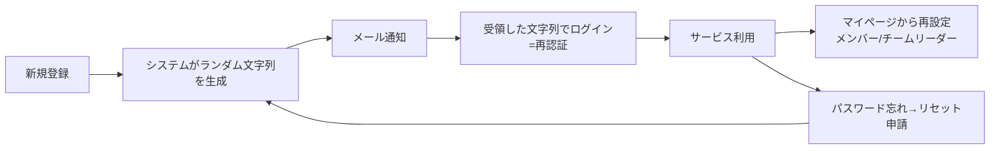

# 認証セキュリティ 要件定義書

作成日：2026-07-26
対象領域：認証 / 認可 / 通信・データ保護 / 個人情報保護 / 監査ログ

## 本書の位置づけ

本書は、既存の要件定義ドキュメントに**すでに記載・決定されている**認証セキュリティ領域の要件を、実装可能な単位に整理し直したものです。

- 出典なしの新規仕様は作成していません。整理上どうしても補足が必要な箇所のみ `※補完` と明示しています。`※補完` は**未確定**であり、承認を得るまで確定要件として扱わないでください。
- 本書に書かれていない事項＝未決事項です。未決事項は `認証セキュリティ_要件定義残タスク.md` に集約しています。
- 実装方式（ライブラリ選定等）は本書の範囲外です。

### 出典の略号

| 略号 | ドキュメント |
|---|---|
| 要求機能 | `Docs/hado-schedule/01_要件定義/アプリケーション要求機能.md` |
| 保護方針 | `Docs/hado-schedule/01_要件定義/個人情報保護方針.md` |
| 技術スタック | `Docs/hado-schedule/技術スタック提案.md` |
| 残タスク | `Docs/hado-schedule/01_要件定義/要件定義残タスク.md` |

---

## 1. 認証要件

### 1.1 確定要件一覧

| ID | 要件 | 内容 | 出典 |
|---|---|---|---|
| AUTH-01 | 登録方式 | 利用者はメールアドレスを利用してユーザー登録を行う | 要求機能「ユーザー認証・登録機能」 |
| AUTH-02 | 複数アカウント | 同一人物による複数アカウント登録を可能とする | 要求機能 |
| AUTH-03 | ログイン必須 | アプリケーションにアクセスする際はログイン認証を行う | 要求機能 |
| AUTH-04 | 二重ログイン禁止 | 各アカウントは二重ログイン不可。すでにログイン中の場合は**後勝ち**とし、既存接続を強制切断する | 要求機能 |
| AUTH-05 | 初回パスワード | 初回登録時、システムがランダムな文字列を生成しメール通知する | 要求機能 |
| AUTH-06 | パスワードリセット | パスワードを忘れた場合はリセットを行い、メール通知して再認証のうえログインする | 要求機能 |
| AUTH-07 | パスワード再設定 | メンバー / チームリーダーはマイページからパスワードを再設定できる | 要求機能 |
| AUTH-08 | パスワード強度 | 最小8文字。大文字・小文字・数字を含むこと | 要求機能「セキュリティ」 |
| AUTH-09 | パスワード保管 | ハッシング・ソルト処理により暗号化して保管する | 要求機能 / 保護方針 4.2 |
| AUTH-10 | アカウントロック | ログインに3回連続で失敗した場合、該当アカウントを30分間ロックする | 要求機能 |
| AUTH-11 | セッションタイムアウト | 30分間アクティビティがない場合、自動ログアウトする | 要求機能 |
| AUTH-12 | API認証 | API通信は認証トークンによる認証を行う | 要求機能 |
| AUTH-13 | 多要素認証 | **行わない**（多段階認証でのログイン管理は実施しない） | 要求機能 |

### 1.2 二重ログイン後勝ち（AUTH-04）に伴う設計制約

要件定義段階で確定している制約として、以下を明記します。

- **サーバー側でセッション状態を保持する方式（DBセッション方式）が必須。** ステートレスな JWT 単独では、発行済みトークンをサーバーから無効化できないため「既存接続の強制切断」を実現できない。
  （出典：技術スタック 6章 未決事項、残タスク B-1。両ドキュメントに同一の制約として記載済み）
- Redis は不採用のため、セッションの保持先は PostgreSQL が推奨とされている。
  （出典：技術スタック 1章「キャッシュ：Redis は不採用。セッションは PostgreSQL に保持」、5章「セッション・キューをサーバーのメモリ上に持たない」）
- ただし**認証方式そのもの（NextAuth.js 採用可否）とセッション保存先は未決**。
  （出典：技術スタック 6章、残タスク B-1）→ 残タスク No.1 参照

### 1.3 パスワードライフサイクル（確定範囲）

- 「初回」と「パスワード再設定時」の双方で、システムがランダム文字列を生成してメール通知する点が要求機能に明記されています。
- リセット後は「再認証してログイン」する流れが明記されています。
- ※補完：上図でリセット申請からランダム文字列生成に戻る経路を示していますが、要求機能には「リセットリンク（ワンタイムトークンURL）を送る方式」なのか「新パスワード文字列そのものを送る方式」なのかの記述がありません。**方式は未決**です（残タスク No.2）。

### 1.4 保護方針に記載のある認証関連の保持期間

| 対象 | 保持期間 | 出典 |
|---|---|---|
| パスワードリセットトークン | 24時間（期限後は自動削除） | 保護方針 5章 |
| セッションCookie | ブラウザを閉じるまで | 保護方針 8.1 |
| 設定Cookie（画面設定・言語設定） | 12ヶ月 | 保護方針 8.1 |
| アクティブユーザー情報 | ユーザー退会時まで | 保護方針 5章 |
| 非アクティブユーザー情報 | 最終ログインから12ヶ月 | 保護方針 5章 |

> 注意：上表の「パスワードリセットトークン 24時間」は**保持期間**の記載であり、セキュリティ上の**有効期限**と同一とは限りません。また「セッションCookie＝ブラウザを閉じるまで」と AUTH-11「30分無操作で自動ログアウト」の関係が定義されていません。いずれも残タスク（No.2 / No.7）で扱います。

---

## 2. 認可要件

### 2.1 ロール定義

システムのロールは以下の4種類です（出典：要求機能「概要」「利用者」）。

| ロール | 概要 |
|---|---|
| メンバー | 一般利用者。自分のプロフィールと自分の予約を管理する |
| チームリーダー | メンバーの操作に加え、チームの管理と申請承認を行う |
| 拠点スタッフ | 自拠点の拠点情報・コート・営業日・予約を管理する。**各拠点1アカウントを拠点のスタッフ間で共有する** |
| システム管理者 | 全データの登録・編集・削除、拠点の追加/削除、チーム登録申請の承認を行う |

### 2.2 ロール別の許可操作（要求機能「利用者」の再掲・整理）

**メンバー（AUTHZ-M）**

| ID | 操作 |
|---|---|
| AUTHZ-M-01 | 自分の名前・プロフィール画像・自己紹介の設定 |
| AUTHZ-M-02 | メインプレースタイル（アタッカー/ディフェンダー/サポーター）の選択 |
| AUTHZ-M-03 | 所属チームの申請（1つのみ） |
| AUTHZ-M-04 | リーグ戦所属チームの申請（1つのみ） |
| AUTHZ-M-05 | コート予約登録 |
| AUTHZ-M-06 | **自分が登録した**予約の編集 / 削除 |
| AUTHZ-M-07 | フリーで募集されている予約への参加登録 |
| AUTHZ-M-08 | 拠点のお気に入り登録 |
| AUTHZ-M-09 | 自分が参加した予約の履歴確認 |

> 注記：お気に入りの上限について、要求機能内に「上限10件」（利用者・メンバー節）と「上限は設けない」（予約検索・フィルター機能節）の**両方の記述があり矛盾**しています。認可判定には直接影響しませんが、機能要件として要確認です（本領域外のため残タスクには含めません。`要件定義残タスク.md` A章へ引き継ぎ）。

**チームリーダー（AUTHZ-L）**

| ID | 操作 |
|---|---|
| AUTHZ-L-01 | メンバーが可能な操作すべて |
| AUTHZ-L-02 | チーム所属申請の承認 |
| AUTHZ-L-03 | リーグ戦所属チームの承認 |
| AUTHZ-L-04 | チームとしてのコート予約登録 |
| AUTHZ-L-05 | **チームとして登録した**予約の編集 / 削除 |
| AUTHZ-L-06 | 他のチームが予約した空チーム欄への参加申請 |
| AUTHZ-L-07 | チーム / リーグ戦チームのチーム名編集・チーム画像登録・チーム紹介編集 |

**拠点スタッフ（AUTHZ-S）**

| ID | 操作 |
|---|---|
| AUTHZ-S-01 | 拠点名の編集、拠点画像の登録 |
| AUTHZ-S-02 | コートの追加 / 削除、コート名の編集 |
| AUTHZ-S-03 | 利用可能設備の編集 |
| AUTHZ-S-04 | 拠点の営業日 / 営業時間の設定（CSVインポートを含む） |
| AUTHZ-S-05 | コートの予約状況の登録 / 削除 / 編集 |
| AUTHZ-S-06 | 拠点イベントとしてのコート予約（イベント予約・店舗予約） |
| AUTHZ-S-07 | コートの利用不可状態の設定（予約を入れることで表現） |

**拠点スタッフの制約（重要）**

- AUTHZ-S-90：拠点スタッフは**自拠点のみ**管理・閲覧可能（出典：要求機能）
- AUTHZ-S-91：拠点スタッフの登録は**各拠点1アカウント**とし、拠点のスタッフ間で共有する（出典：要求機能）
- AUTHZ-S-92：拠点スタッフの操作は**すべてログに記録**される。誰が操作したかは**ログイン時刻から推測**する運用とする（出典：要求機能）

**システム管理者（AUTHZ-A）**

| ID | 操作 |
|---|---|
| AUTHZ-A-01 | すべてのメンバー / チームリーダー / チーム / 拠点 / 拠点スタッフ / コート / 予約の情報の登録・編集・削除 |
| AUTHZ-A-02 | メンバーからのチーム / リーグ戦チーム登録申請の承認 |
| AUTHZ-A-03 | 拠点の追加 / 削除 |
| AUTHZ-A-04 | 拠点の新規登録（出典：要求機能「拠点」節の「アプリ管理者が行う」） |

### 2.3 リソース所有権に基づく認可（横断ルール）

| ID | ルール | 出典 |
|---|---|---|
| AUTHZ-R-01 | 予約の編集・削除は**予約者のみ**が可能。ただしシステム管理者は全予約の編集・削除が可能 | 要求機能「予約」 |
| AUTHZ-R-02 | 拠点に紐づくリソース（コート、営業日、拠点内の予約）への拠点スタッフのアクセスは、**自拠点に属するものに限定**する | 要求機能（AUTHZ-S-90 の適用） |
| AUTHZ-R-03 | プロフィール情報の編集は本人のみ（「自分の名前」「自分のプロフィール画像」「自分の自己紹介」の記述による）。システム管理者は全ユーザー情報を編集可 | 要求機能 |

**認可判定の実施場所（横断・確定事項として明記）**

- ※補完：要求機能に明文の記載はありませんが、AUTHZ-R-01/02 を成立させるには、ロールおよび所属拠点IDをクライアントからの申告値ではなくサーバー側で保持するセッション情報から解決する必要があります。実装方針として `.claude/agents/auth-security-engineer.md` に「権限判定は必ずサーバ側」「リソース単位で所有・所属関係まで検証する（IDOR対策）」が定められており、これに従います。

### 2.4 権限マトリクスの未整備

機能ごとのCRUD権限マトリクスは**未作成**です（出典：残タスク A-3）。本書 2.2 は要求機能の記述を整理したもので、記述のない組み合わせ（例：チームリーダーが他人のプロフィールを閲覧できる範囲、拠点スタッフが自拠点の予約参加者情報をどこまで見られるか）は決まっていません。→ 残タスク No.11 参照。

---

## 3. 通信・データ保護要件

| ID | 要件 | 内容 | 出典 |
|---|---|---|---|
| SEC-01 | 通信暗号化 | 通信はすべて暗号化する（**TLS 1.2 以上**） | 要求機能「セキュリティ」/ 保護方針 4.1 |
| SEC-02 | 個人情報の暗号化保管 | 個人情報に関するデータは暗号化して保管する | 要求機能「データベース要件」/ 保護方針 4.2 |
| SEC-03 | パスワード保管 | ハッシング・ソルト処理により暗号化して保管する（AUTH-09 と同一） | 要求機能 / 保護方針 4.2 |
| SEC-04 | DBアクセス制御 | データベースは厳格なアクセス制御下に保管する | 保護方針 4.2 |
| SEC-05 | セキュリティ監査 | 定期的なセキュリティ監査を実施する | 保護方針 4.2 |
| SEC-06 | ペネトレーションテスト | 初回リリース前にセキュリティテスト（ペネトレーションテスト）を実施する | 要求機能「テスト・品質要件」 |
| SEC-07 | 継続監視 | 初回リリース以降は自動セキュリティスキャンツール（SAST / DAST）で継続監視する | 要求機能 |
| SEC-08 | ログへの秘匿情報非出力 | ログに個人情報・パスワード・トークンを出力しない（Prisma のクエリログ設定を含む） | 技術スタック 4.4 |
| SEC-09 | 秘密情報の管理 | 環境変数は `.env.local`（Git管理外）、CI は GitHub Secrets、本番の秘密情報ファイルは NTFS ACL で保護 | 技術スタック 3章 / 残タスク B-0 |
| SEC-10 | TLS証明書運用 | win-acme（Let's Encrypt）による自動更新。更新失敗の検知を監視項目に含める | 技術スタック 2.3 / 4.3 |
| SEC-11 | 公開面の限定 | Node を直接インターネットに公開せず、IIS（URL Rewrite + ARR）をリバースプロキシとして前段に置く | 技術スタック 2.3 |

> SEC-01 に関する運用上の注記：TLS 1.2 以上の強制は「宣言」ではなく Windows Server の SCHANNEL 設定として実在させる必要があります（`.claude/agents/security-reviewer.md` の本番Windows Server固有観点）。設定手順自体はインフラ領域のため本書では扱いません。

---

## 4. 個人情報保護方針から導かれる遵守事項

### 4.1 保護対象データ（保護方針 2章）

| 区分 | 項目 |
|---|---|
| 基本情報 | プレイヤーネーム、メールアドレス、パスワード |
| プロフィール情報 | プロフィール画像、自己紹介文、プレースタイル |
| 予約関連情報 | 予約日時、拠点・コート選択、チーム情報、キャンセルポリシー記載内容 |
| 自動収集情報 | IPアドレス、ユーザーエージェント、アクセス日時・ログ、Cookie情報 |
| 団体情報 | チーム名・画像・紹介、拠点名・画像、コート名・設備情報 |

- 付録の用語定義により、**IPアドレスとクッキーIDは「個人識別符号」**として扱われます。ログ設計・Cookie設計はこの前提に立つ必要があります。

### 4.2 遵守事項

| ID | 遵守事項 | 出典 |
|---|---|---|
| PRIV-01 | 個人情報へのアクセスは職務上必要な者に限定する | 保護方針 4.3 |
| PRIV-02 | 拠点スタッフ・システム管理者も、自部門・業務範囲内のみアクセス可能とする（＝管理者ロールであっても無制限アクセスを前提としない） | 保護方針 4.3 |
| PRIV-03 | アクセスログは監査目的で保持する | 保護方針 4.3 |
| PRIV-04 | 利用目的（保護方針 3章）の範囲を超えて個人情報を利用しない | 保護方針 3章 |
| PRIV-05 | 法的根拠がない限り第三者提供しない。例外は法的要求、およびスキーム参加者間での必要情報（チームリーダーが所属チーム員の予約情報を確認する場合／拠点スタッフが自拠点のユーザー情報を確認する場合） | 保護方針 6章 |
| PRIV-06 | メール配信サービス・ホスティング事業者への提供は、契約による処理制限およびセキュリティ基準の充足を条件とする | 保護方針 6.3 |
| PRIV-07 | ユーザーからの開示請求・訂正/追加/削除申請・処理中止申請・退会申請に対応する | 保護方針 7章 |
| PRIV-08 | 上記申請への対応期限は**申請から14営業日以内** | 保護方針 7.5 / 12章 |
| PRIV-09 | 日本の個人情報の保護に関する法律（APPI）に準拠する | 保護方針 10章 |
| PRIV-10 | 本サービスは従業者を有しない（＝運用要員を前提とした統制を要件に置けない） | 保護方針 4.4 |

> PRIV-05 は認可要件に直結します。「チームリーダーが所属チーム員の予約情報を確認できる」「拠点スタッフが自拠点のユーザー情報を確認できる」ことは方針上許容されていますが、**閲覧できる項目の範囲**（メールアドレスを含むか等）は定義されていません → 残タスク No.11。
>
> PRIV-10（従業者なし）と PRIV-08（14営業日以内の対応）は、**申請対応を人手の運用で吸収できない**ことを意味します。システム機能側での支援が必要になります → 残タスク No.10。

### 4.3 保持期間に関する記述の不整合（要確認）

| 対象 | 保護方針の記載 | 要求機能の記載 | 状態 |
|---|---|---|---|
| アクセスログ / 監査ログ | アクセスログ 90日間（5章） | 監査ログ 180日間（データベース要件） | **矛盾の可能性**。両者が同一物か別物かが未定義 |
| 予約履歴 | 予約日から24ヶ月（5章） | 日付が過ぎた時点で物理削除。ただし紛争解決に必要な情報は12ヶ月保持 | **矛盾**（24ヶ月 / 12ヶ月） |
| 退会ユーザー情報 | 保持期間に従って管理（7.4） | 退会時点で物理削除（データ保持・削除ポリシー） | **矛盾の可能性** |

本書はこれらを確定要件として記載しません。→ 残タスク No.8 / No.10 参照。

---

## 5. 監査・ログ要件

### 5.1 確定要件

| ID | 要件 | 内容 | 出典 |
|---|---|---|---|
| LOG-01 | 監査ログ保持 | 監査ログ（ユーザーの操作・データ変更）は180日間保持する | 要求機能「データベース要件」 |
| LOG-02 | アクセスログ保持 | アクセスログは90日間保持する（セキュリティ監査目的） | 保護方針 5章 |
| LOG-03 | ログイン状態の記録 | 利用者のログイン状態と、すべてのデータベース操作に関する状態をログファイルに記録する | 要求機能「エラーハンドリング」 |
| LOG-04 | 拠点スタッフ操作の記録 | 拠点スタッフの操作はすべてログに記録される | 要求機能「利用者・拠点スタッフ」 |
| LOG-05 | ログレベル | INFO 以上を記録する | 要求機能「運用・保守要件」 |
| LOG-06 | ログローテーション | 月曜日〜日曜日で記録し、5世代まで管理する。Windows には logrotate がないためアプリ側（pino / winston 等）またはタスクスケジューラで明示的に実装する | 要求機能 / 技術スタック 4.4 |
| LOG-07 | ログの秘匿情報 | ログに個人情報・パスワード・トークンを出力しない（SEC-08 と同一） | 技術スタック 4.4 |
| LOG-08 | メール配信失敗 | メール配信に失敗した場合はシステムログに記録し、3回まで自動リトライする | 要求機能「キャンセルポリシー管理・通知機能」 |
| LOG-09 | 監視 | アプリケーションログのエラー率を Zabbix の監視項目に含める | 技術スタック 4.3 |

### 5.2 共有アカウント（拠点スタッフ）の追跡方法

要求機能で決まっている事項は次の3点のみです。

1. 拠点スタッフのアカウントは**各拠点1つ**で、拠点のスタッフ間で共有される（AUTHZ-S-91）
2. 拠点スタッフの操作は**すべてログに記録**される（AUTHZ-S-92 / LOG-04）
3. **誰が操作したかはログイン時刻から推測する**（AUTHZ-S-92）

つまり本システムは、共有アカウントに対して「技術的な個人特定」ではなく「**ログイン時刻を手がかりとした事後の推測**」を許容する方針です。この方針を成立させるための最低条件として、以下を要件化します。

- ※補完：LOG-A（推奨）— 監査ログの各レコードに、少なくとも「**ログイン日時**」「**セッション識別子**」「操作日時」「操作種別」「対象リソース」「送信元IPアドレス」を含める。ログイン時刻から操作者を推測する運用は、監査ログの行と特定のログインセッションを結びつけられて初めて成立するため。
  （根拠：AUTHZ-S-92 の運用方針、および `.claude/agents/auth-security-engineer.md` 5項「セッションIDとログイン時刻を監査ログに必ず残す」）
- ※補完：LOG-B（推奨）— 監査ログは改ざんが困難な形（追記のみ、アプリケーションユーザーからの UPDATE / DELETE を許可しない等）で保持する。
  （根拠：`.claude/agents/security-reviewer.md`「監査ログが改ざん困難な形で残るか」）

上記2点はいずれも `※補完` であり、確定要件ではありません。監査ログの記録項目そのものが要件定義に存在しないことを残タスク No.9 で扱います。

---

## 6. 本書で扱わない事項

以下は本領域の範囲外、または他ドキュメントで決定済みです。

| 事項 | 参照先 |
|---|---|
| 画面設計・画面遷移の詳細 | `要件定義残タスク.md` A-1、`画面ワイヤー下書き.md` |
| インフラ構築手順、サーバースペック、コスト | `技術スタック提案.md` 2章 |
| バックアップ / RTO / RPO / メンテナンス枠 | `技術スタック提案.md` 4.2 / 5章、`要件定義残タスク.md` A-8 |
| メール送信プロバイダの選定 | `要件定義残タスク.md` B-2 |
| ER図・API設計・エラーコード設計 | `要件定義残タスク.md` A-4 / A-5 / A-7 |
| 多要素認証 | **要求機能で「行わない」と決定済み**。提案・設計の対象としない |

---

## 改訂履歴

| 日付 | 内容 |
|---|---|
| 2026-07-26 | 初版作成。既存の要件定義ドキュメントから認証セキュリティ領域の確定事項を集約 |
