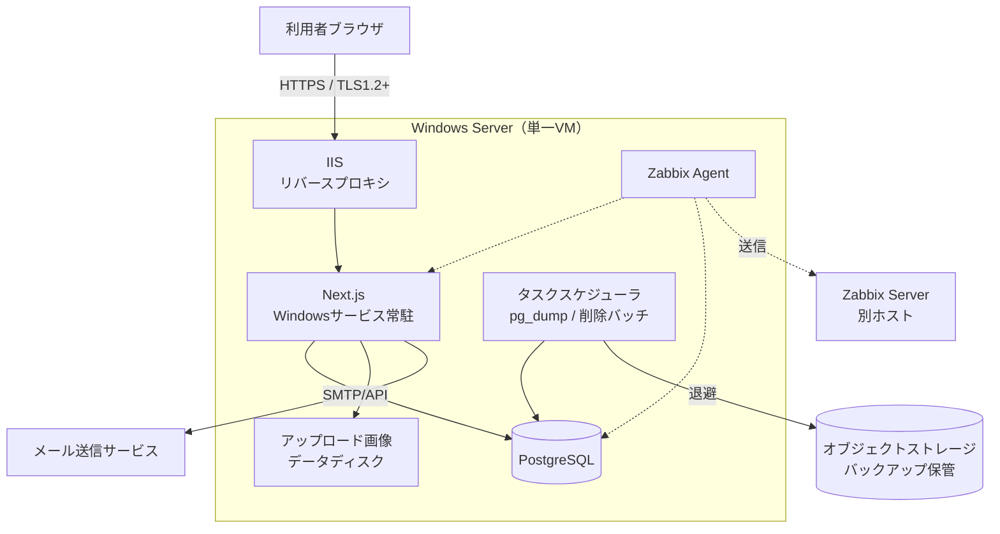

# 技術スタック

作成日：2026-07-12
最終更新：2026-07-26（本番構成を「案1：単一VM 全部入り」に決定し、全面改訂）

目的：基本設計に進むための技術構成を確定事項として記録します。未決の項目は末尾にまとめています。

## 1. 決定事項サマリ

| 分類 | 採用 | 備考 |
|---|---|---|
| フレームワーク | Next.js 16（App Router） | 実装済み `Source/Next.js/hado-schedules/` |
| 言語 | TypeScript（strict） | |
| UI | React 19 + Tailwind CSS v4 | |
| データベース | PostgreSQL | セルフホスト |
| ORM | **Prisma** | マイグレーション管理も Prisma |
| 本番OS | **Windows Server** | オンプレ／VM |
| 本番構成 | **案1：単一VM 全部入り** | アプリ・DB・監視エージェントを1台に同居 |
| リバースプロキシ | IIS（URL Rewrite + ARR） | |
| プロセス常駐 | Windows サービス（nssm 等） | |
| CI/CD | GitHub Actions | |
| 監視 | Zabbix | |
| キャッシュ | **Redis は不採用** | 単一VM構成のため。セッションは PostgreSQL に保持 |
| コンテナ | **Docker は不採用** | Windows コンテナの制約が利点を上回る |

Vercel / AWS RDS / サーバレスは**不採用**（2026-07-26 時点の旧案）。これらを前提とした設計・実装を行わないこと。

## 2. 本番構成（案1：単一VM 全部入り）

### 2.1 サーバースペック

| 項目 | 推奨 | 最小 |
|---|---|---|
| CPU | 4 vCPU | 2 vCPU |
| メモリ | 16 GB | 8 GB |
| OSディスク | 100 GB SSD | 80 GB SSD |
| データディスク | 100 GB SSD（別ボリューム） | OSディスク同居も可 |

同時接続100人・予約登録5件/分の要件に対しては余裕があります。メモリは Windows Server 本体 + PostgreSQL + Node.js + IIS の同居分を見込んで16GBを推奨します。

**PostgreSQLのデータとアップロード画像はOSディスクと別ボリュームに置くこと。** OS再構築時にデータを巻き込まないためです。

### 2.2 概算コスト（月額）

| 提供形態 | 目安 |
|---|---|
| 国内VPS（Windows Server プラン 8GB） | 1〜2万円 |
| Azure / AWS の Windows VM（4vCPU/16GB） | 2.5〜5万円 |
| バックアップ用オブジェクトストレージ | 数百円 |
| Zabbix Server 用の小型VM（Linux・別ホスト） | 3,000〜5,000円 |

契約時点で実見積もりを取得してください。オンプレに新規調達する場合は Windows Server ライセンスと **CAL / External Connector の要否**を事前に確認すること（クラウドVMは時間課金にライセンスが含まれるため、この論点は発生しません）。

### 2.3 ミドルウェア

| 用途 | 採用 | 補足 |
|---|---|---|
| Node.js | 22 LTS | `package.json` の `engines` でバージョンを固定する。Next.js 16 の最低要件を `node_modules/next` のドキュメントで確認すること |
| PostgreSQL | 17（EDB の Windows インストーラ） | **`btree_gist` 拡張が必要**（予約の時間帯重複防止に使う排他制約のため） |
| リバースプロキシ | IIS + URL Rewrite + ARR | Node を直接インターネットに公開しない |
| サービス化 | nssm または node-windows | 障害時の再起動アクションと自動起動を設定する |
| TLS証明書 | win-acme（Let's Encrypt 自動更新） | 更新失敗の検知を監視項目に含める |
| 画像保存 | データディスク上のディレクトリ | 保存先を差し替えられる形で実装する（第5章参照） |

## 3. 開発環境

`技術スタック整理.md` の手順が基本です。差分のみ記載します。

- ORM は Prisma。`npx prisma init` 済みのスキーマを `Source/Next.js/hado-schedules/prisma/` に配置する
- ローカルDBは `hado_schedules_dev`、テスト用に `hado_schedules_test` を別途用意する
- 環境変数は `.env.local`（Git管理外）。CI は GitHub Secrets
- テストは Jest + React Testing Library、E2E は Playwright（**未導入**）

### Prisma 運用ルール（重要）

1. **`prisma db push` は使用しない。** 予約の時間帯重複を防ぐ排他制約（`EXCLUDE USING gist`）と部分一意インデックスは Prisma スキーマで表現できず、マイグレーションSQLに手書きで追加する。`db push` はこれを失う
2. スキーマ変更は `prisma migrate dev --create-only` でSQLを生成し、必要な手書きSQLを追記してから適用する
3. **本番へは `prisma migrate deploy`。** `migrate dev` / `migrate reset` は本番で実行しない
4. 日時カラムは `@db.Timestamptz` を明示する（無指定だとタイムゾーンなしになる）
5. 外部キーカラムには `@@index` を明示する（Prisma は自動作成しない）

## 4. 運用

### 4.1 メンテナンス枠

**週1回 0:00〜5:00**（コート利用時間 10:00〜22:00 の外）。実施曜日は未決。

- Windows Update とアプリのデプロイはこの枠内で実施する
- **Windows Update が枠外に再起動を起こさない設定**（アクティブ時間 / 更新の一時停止 / WSUS）を必ず入れる
- 枠内に収まらない場合の中断・切り戻し判断基準を手順に定める
- 実施は全ユーザーへ事前通知する（要件）

### 4.2 バックアップ

- `pg_dump` をタスクスケジューラで毎日 03:00 実行、30日保持
- **取得後は必ずオブジェクトストレージ等の別ロケーションへ退避する。** 単一VM構成のため、サーバー内にのみ保持するとサーバー障害時に一緒に失われる
- バックアップの成否を Zabbix で監視する
- **メンテナンス実施日は 03:00 のバックアップと作業が重なる。** 作業順序（バックアップ完了を待って開始する等）を手順化すること

### 4.3 監視（Zabbix）

Zabbix Server は**監視対象と同居させない**（サーバーごと落ちたとき検知できないため）。別の小型Linux VM か外形監視SaaSを併用します。

監視項目には以下を含めること。

- CPU 80% / メモリ 85% 超過でアラート（要件）
- Windows サービス（Next.js アプリ / PostgreSQL）の稼働状態
- 外形監視：ログイン、スイムレーン表示、予約API の応答と応答時間（画面表示3秒 / 予約登録5秒）
- ディスク空き容量、TLS証明書の有効期限、バックアップジョブの成否
- アプリケーションログのエラー率

### 4.4 ログ

**Windows に logrotate は存在しない。** ローテーションはアプリ側（pino / winston 等）かタスクスケジューラのスクリプトで明示的に実装する。

- ログレベル INFO 以上、月〜日で記録し5世代管理（要件）
- 監査ログは180日保持
- ログに個人情報・パスワード・トークンを出力しない（Prisma のクエリログ設定を含む）

### 4.5 デプロイ

GitHub Actions の Linux ランナーからオンプレ Windows Server へは直接デプロイできません。**Windows セルフホストランナー**を本番VMに置く方式が案1では最も安価です。

- **セルフホストランナーはプライベートリポジトリでのみ使用すること。** パブリックリポジトリでは第三者のPRから任意コードを実行される
- 手順は「ビルド成果物の配置 → `prisma migrate deploy` → サービス再起動」。各段の失敗時の切り戻し手段をセットで用意する

## 5. 案1で受け入れるリスクと将来の移行

案1は単一障害点を持つ構成であり、以下を許容した上での選択です。

| リスク | 内容 |
|---|---|
| SLA | 単一VM構成の実効可用性は 99.5% 程度。要件の **99.9%（非計画停止 月約42分）は契約上保証できない** |
| RPO | 日次バックアップのみのため**最大24時間**。障害時は最大1日分の予約が失われる |
| RTO | 手動リストアのため**数時間**。月42分の枠には収まらない |

**RTO / RPO は未決のため、この実測値を前提に目標値を設定してください。**

### 将来「案2」への移行に備えた設計上の約束

案2 = アプリVM + マネージドPostgreSQL（月4〜7万円、RPO数分・バックアップ自動化）。ユーザー数増加や停止許容度の低下が起きたら移行します。初期から次を守れば移行コストはほぼゼロになります。

1. DB接続は `DATABASE_URL` 環境変数のみで切り替わるようにする（Prisma の標準構成に従えば自然に満たせる）
2. 画像の保存・取得はローカルパスをコード全体に散らさず、保存先を差し替えられる層を1つ挟む
3. セッション・キューをサーバーのメモリ上に持たない（PostgreSQL に保持する）

## 6. 未決事項

| 項目 | 選択肢・補足 |
|---|---|
| 認証方式 | NextAuth.js 採用可否。**二重ログイン後勝ちの要件により、サーバー側セッション（DBセッション方式）が必須**。ステートレスJWT単独では旧トークンを無効化できない |
| セッション保存先 | Redis 不採用のため PostgreSQL を推奨 |
| メール送信 | Amazon SES（従量・安価）/ SendGrid（無料枠後 月$20程度） |
| メンテナンス実施曜日 | 火〜木の早朝を推奨（週末はコート利用が多く、作業延長時の影響が大きい） |
| RTO / RPO 目標値 | 第5章の実測値を踏まえて設定する |
| クラウド提供元 | 国内VPS / Azure / AWS |
| ログ集約 | 単一VM構成のためローカル保持で足りるが、将来の集約先を検討 |
| E2Eテスト | Playwright 採用可否 |

## 7. 次アクション

1. クラウド提供元とインスタンスを決定し、実見積もりを取得する
2. 認証方式を決定する（セッション方式の制約に注意）
3. Prisma スキーマのスケルトンを作成（User, Team, Venue, Court, Reservation, Participation, AuditLog）
4. 排他制約 `EXCLUDE USING gist` を含む初回マイグレーションを作成する
5. GitHub Actions の最小 CI を構築（lint / 型チェック / build）
6. メンテナンス実施曜日と RTO / RPO を確定する
