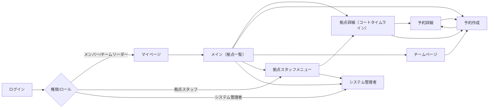

# 画面遷移図（概要）

以下は主要画面の遷移図です。必要に応じてMermaidを使って視覚化しています。

補足:
- `拠点詳細` は日付／コートを変更することでタイムラインが変わります。
- スタッフ／管理者はメニューから管理画面へ遷移できます。
- `チームページ`は権限別モード表示:
  - **メンバー**: 閲覧のみ（チーム情報・メンバー一覧・予約確認）
  - **チームリーダー**: 編集・管理（チーム情報編集・メンバー承認・予約管理・申請承認）